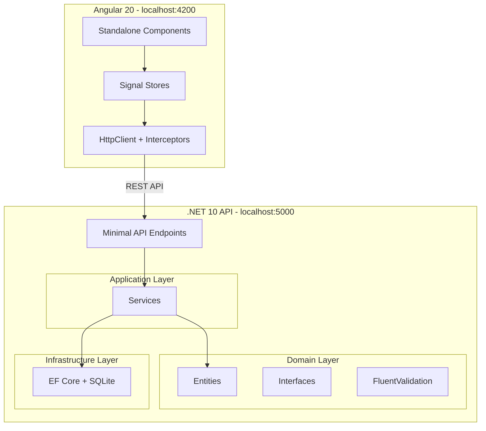

# Kudos App

A peer-to-peer employee recognition application where employees give each other kudos, earn points, and celebrate contributions.

## Tech Stack

| Layer | Technology | Version |
|-------|-----------|---------|
| Backend | .NET (ASP.NET Core Web API) | 10.0 |
| Frontend | Angular (standalone, signals) | 20.x |
| Database | SQLite (via EF Core) | — |
| AI | OpenAI API (content moderation) | gpt-4o-mini |
| Containerization | Docker Compose | — |

### Why this stack?
- **.NET 10**: LTS release, excellent performance, built-in validation, output caching, OpenAPI 3.1
- **Angular 20**: Standalone components, signals for reactive state, new control flow syntax, OnPush by default
- **SQLite**: Zero-config, portable `.db` file, perfect for demo — production would use PostgreSQL
- **Docker Compose**: Single `docker compose up` to run everything

## Architecture

**Backend — 4-layer Clean Architecture**:
- `KudosApp.Api` — Minimal API Endpoints, Middleware
- `KudosApp.Domain` — Entities, DTOs, Interfaces, FluentValidation Validators
- `KudosApp.Application` — Service implementations, Business logic
- `KudosApp.Infrastructure` — EF Core DbContext, SQLite

**Frontend — Feature-based**:
- `core/` — Guards, interceptors, layout (singletons)
- `shared/` — Domain types, signal stores, API services, reusable UI components
- `features/` — Lazy-loaded routes (auth, feed, profile, leaderboard, admin)



## Setup & Run

### Prerequisites
- Docker & Docker Compose
- (Optional) .NET 10 SDK, Node.js 22+, Angular CLI

### Quick Start (Docker)
```bash
git clone https://github.com/dlondono-applaudo/kudos-app.git
cd kudos-app
cp .env.example .env
# Edit .env and set your OPENAI_API_KEY
docker compose up
```
- **Frontend**: http://localhost:4200
- **API**: http://localhost:5000
- **Scalar (API docs)**: http://localhost:5000/scalar/v1

### Local Development
```bash
# Backend
cd backend
dotnet run --project src/KudosApp.Api

# Frontend (separate terminal)
cd frontend
npm install
ng serve
```

## Features

### Core (Minimum Requirements)
- [x] User registration and login (JWT)
- [x] Give kudos to another employee (recipient, category, message)
- [x] Public kudos feed
- [x] Points system (categories have different point values)
- [x] Role-based access (User / Admin)
- [x] SQLite database
- [x] Angular Web UI

### Extended
- [x] Badges and achievements
- [x] Leaderboard
- [x] Admin dashboard
- [x] Notifications (in-app)
- [x] Audit logging

### AI Features
- [x] AI Content Moderation — validates kudos messages are appropriate, professional, and genuine before posting
- [x] Smart Compose — AI generates kudos message suggestions based on category and intent
- [x] Sentiment Analysis — assigns emoji tag to each kudos based on message tone

## Running Tests

```bash
cd backend
dotnet test tests/KudosApp.Tests/KudosApp.Tests.csproj
```

**Test coverage** (45 tests):
- `AuthEndpointTests` — registration, login, duplicate email, wrong password
- `KudosEndpointTests` — feed access, auth enforcement, create kudos, admin-only delete, health check
- `CategoriesEndpointTests` — seeded categories, point values, anonymous access
- `LeaderboardEndpointTests` — anonymous access, ranked entries after kudos
- `NotificationsEndpointTests` — auth enforcement, unread count, mark read, kudos-triggered notifications
- `UsersEndpointTests` — profile retrieval, user listing, anonymous profile access
- `KudosEntityTests` — entity creation, self-kudos guard, empty message guard, sentiment emoji
- `EntityTests` — ApplicationUser, Category, Badge, UserBadge, Notification, AuditLog factories
- `OpenAiServiceTests` — fallback responses without API key, auto-approval

## AI Tools Used

| Tool | How it helped |
|------|--------------|
| GitHub Copilot | Code generation, autocompletion, test generation |
| Claude (via VS Code) | Architecture planning, code review, full-file generation |

## AI Artifacts
- [`.github/copilot-instructions.md`](.github/copilot-instructions.md) — Project context for Copilot
- [`CLAUDE.md`](CLAUDE.md) — Project rules for Claude

## Default Credentials

| Role | Email | Password |
|------|-------|----------|
| Admin | admin@kudos.com | Admin123! |
| User | user@kudos.com | User123! |

## API Endpoints

| Method | Endpoint | Auth | Description |
|--------|----------|------|-------------|
| POST | `/api/auth/register` | — | Register new user |
| POST | `/api/auth/login` | — | Login, get JWT |
| GET | `/api/kudos` | — | Public kudos feed |
| POST | `/api/kudos` | Bearer | Send kudos |
| GET | `/api/kudos/{id}` | — | Get single kudos |
| GET | `/api/kudos/sent` | Bearer | My sent kudos |
| GET | `/api/kudos/received` | Bearer | My received kudos |
| DELETE | `/api/kudos/{id}` | Admin | Delete kudos |
| GET | `/api/categories` | — | List categories |
| GET | `/api/leaderboard` | — | Points leaderboard |
| GET | `/api/users` | Bearer | All users |
| GET | `/api/users/me` | Bearer | My profile |
| GET | `/api/users/{id}` | — | User profile |
| GET | `/api/notifications` | Bearer | My notifications |
| POST | `/api/notifications/{id}/read` | Bearer | Mark read |
| POST | `/api/notifications/read-all` | Bearer | Mark all read |
| POST | `/api/ai/suggest-message` | Bearer | AI message suggestions |
| GET | `/health` | — | Health check |

## What I Would Do Next
- Migrate to PostgreSQL for production (SQLite is single-writer)
- Add refresh tokens and token rotation
- Implement WebSocket/SSE for real-time notifications
- Add image attachments on kudos
- Quarterly kudos allocation system
- Gift catalog and point redemption
- E2E tests with Playwright
- CI/CD pipeline with GitHub Actions

## Project Structure
```
kudos-app/
├── backend/                # .NET 10 Web API (Clean Architecture)
│   ├── KudosApp.slnx
│   ├── src/
│   │   ├── KudosApp.Api/
│   │   ├── KudosApp.Domain/
│   │   ├── KudosApp.Application/
│   │   └── KudosApp.Infrastructure/
│   └── tests/
│       └── KudosApp.Tests/
├── frontend/               # Angular 20 (standalone, signals)
│   ├── src/app/
│   │   ├── core/
│   │   ├── shared/
│   │   └── features/
│   └── ...
├── database/               # Reference SQL schema and seed data
├── docs/                   # Additional documentation
├── docker-compose.yml      # Single-command setup
├── .env.example            # Environment variable template
├── .github/
│   └── copilot-instructions.md
└── CLAUDE.md
```